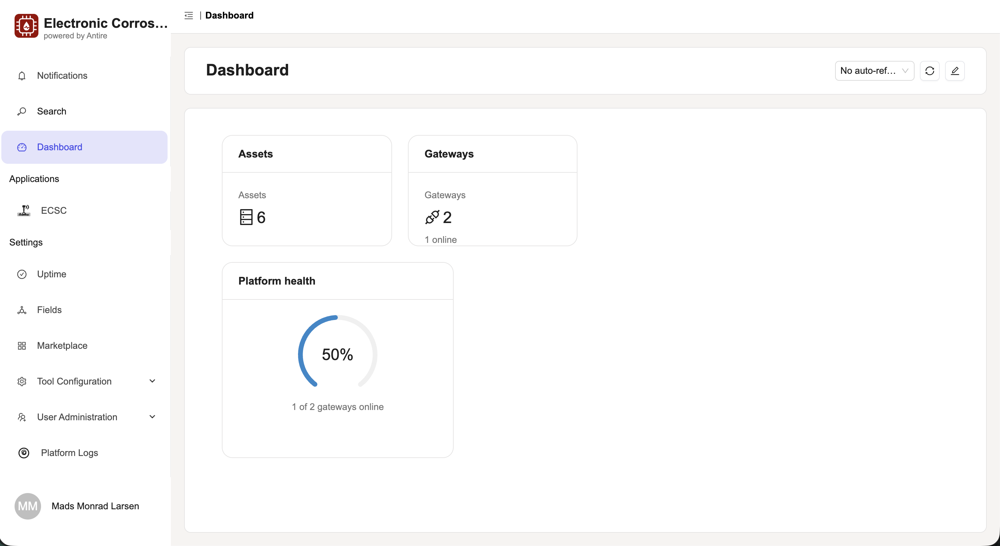
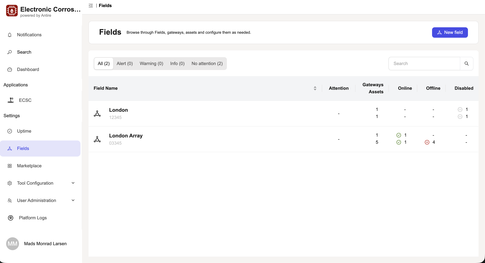
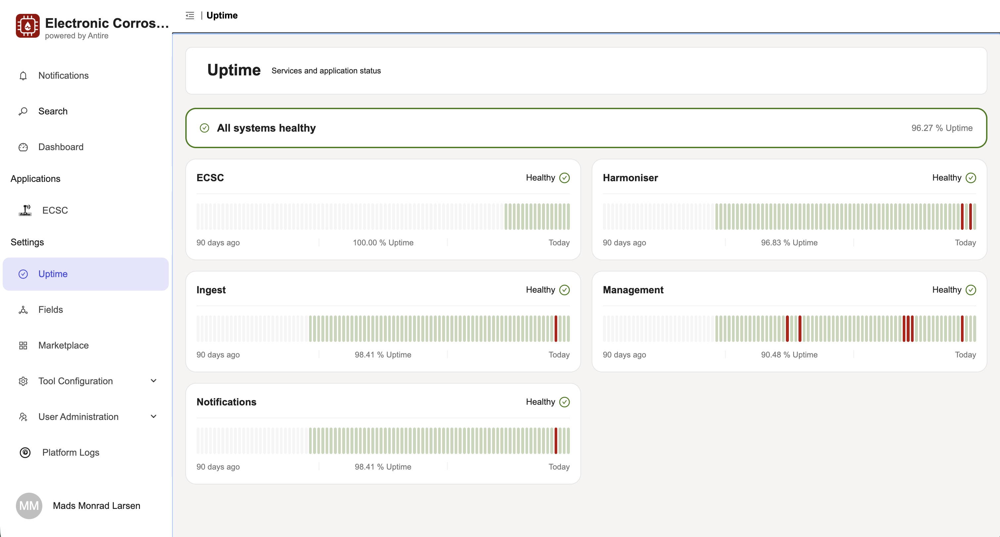
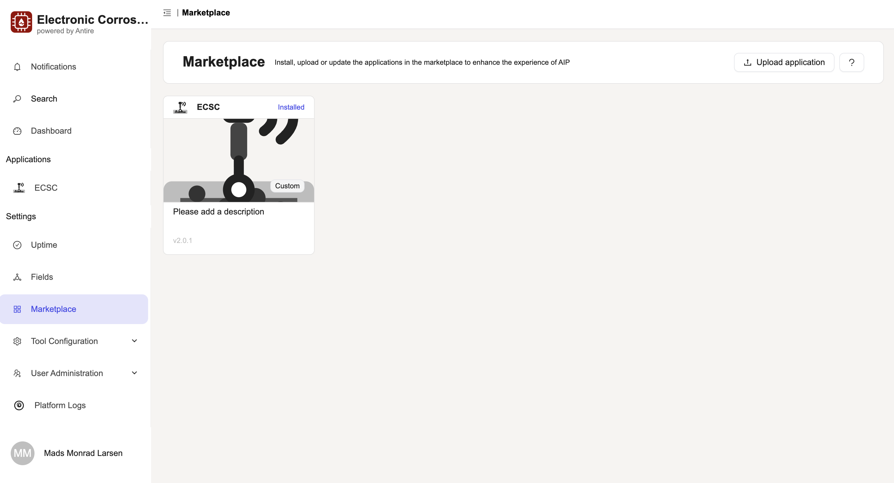
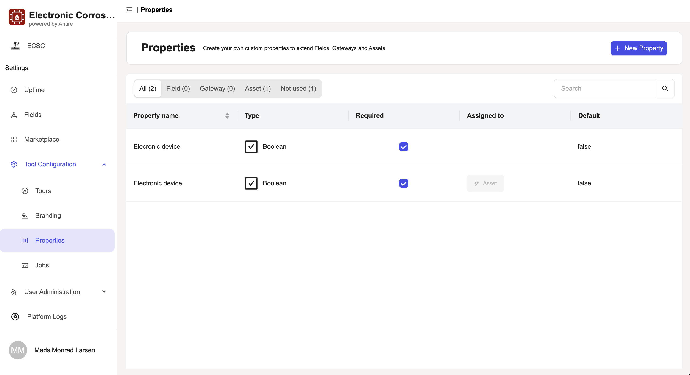
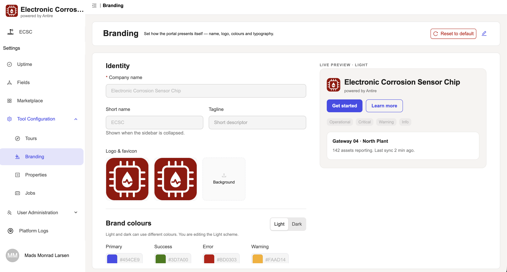
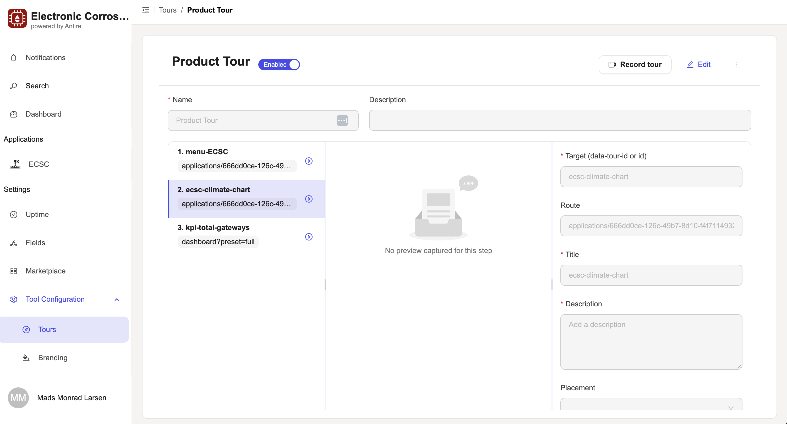
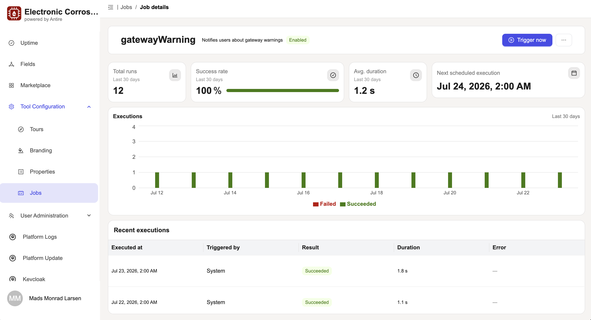
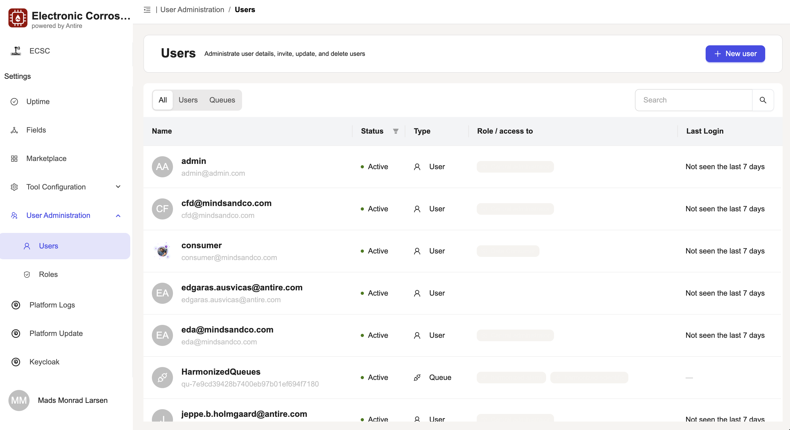
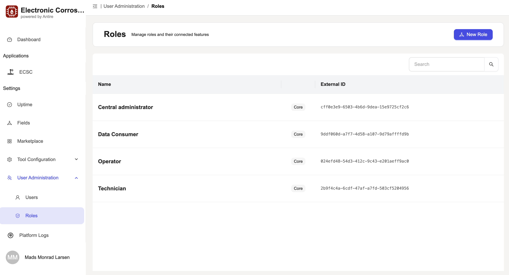

# Product tour

A look at the management portal in daily use. Every screen below is the live product, not a mockup.

## Dashboard

The dashboard is where your team lands and takes in the whole installation at a glance. Assets, gateways, users, and scheduled jobs sit alongside platform health and asset status, so the moment someone opens the portal they can see whether everything is running or something needs attention, without hunting through separate screens.

Build the view around what each team actually needs. Arrange the built-in widgets so the numbers that matter to an operator, a manager, or a technician are front and center, and use each widget as a starting point to move straight into the detail behind it. A focused dashboard turns the daily check into a few seconds rather than a tour of the platform.

When the built-in widgets do not cover a specific need, build your own. Widgets ship as plugins, written in the frontend framework your teams already know, so you can surface exactly the data and controls your operation depends on and keep the dashboard growing with you.

## Fields

Fields are how you organize your estate inside the platform. A field groups the gateways and assets you manage together, such as a solar site, a wind park, or a portfolio cluster, and rolls up online, offline, and disabled counts so you can spot a struggling site before it becomes a problem.

A field is also where you keep the site secure. Operators generate and rotate the secrets and certificates that authenticate each gateway, so the connection between your equipment and the platform stays trusted and you can retire credentials the moment they should no longer work.

Names and IDs are rarely enough on their own, so you can add [custom properties](#properties) to any field, gateway, or asset and capture the details your business runs on, from warranty dates to site contacts. When you want the paperwork next to the equipment, create a field and upload your documentation directly, so everything about a site lives in one place.

## Uptime and health

The platform keeps an eye on its own health so you do not have to. Every service reports in continuously and the platform runs its own checks around the clock, so a problem is caught as it happens rather than when someone notices data has stopped flowing. Each service shows a 90-day history, which makes it easy to confirm everything is running today and to look back at how the platform has behaved over time. If a past incident ever raises a question, the record is right there and you can see what happened and when at a glance. That transparency means you can trust the numbers you act on, because you always know the system behind them is up and running.

## Marketplace

Asset Insights Portal grows with your business. It is the foundation you build on, not a fixed feature set. The built-in marketplace is where you extend it: browse the available integrations and add-ons, install the ones you need, and they appear in the portal ready to use, with no separate deployment and no rebuild of the core.

Reach for it whenever a new need appears. Connect your ERP, add command and control capabilities, wire in your own systems, or bring any other integration into your setup. When you need something specific, your team can build it and extend the portal in the frontend framework they already use, and the applications you install can carry their own [guided tours](#tours) so people know how to use them from day one.

Adding capabilities stays under your control. Only the people you choose can install or manage what runs in the marketplace, so the platform keeps pace with your operation and no one bolts on tools you have not approved.

## Properties

Think of properties as custom fields you define once and reuse. Give a property a name and a type, such as a number, a date, a yes or no, a short text, or a pick list, then attach it to your assets, fields, or gateways. Your teams capture the details your business runs on, from warranty dates to site contacts to turbine model, without waiting for a code change or a new release. The platform stores these alongside the standard production and availability data, so everything about an asset lives in one place.

## Branding

Make the portal your own. Set your company name, logo, favicon, background, colors, and typography, and they carry through every screen, from the sign-in page to daily work. Your teams see a tool that looks like it belongs to your company, not a third-party product they have to learn to trust.

That familiarity starts at the login screen. Your brand is already in place before anyone signs in, so people recognize where they are and know the platform is theirs, which makes day-to-day use feel natural and reassuring. One consistent look across the portal and any applications you add means fewer questions, smoother adoption, and a team that feels at home in the tools they rely on every day.

## Tours

Guided tours walk people through the portal step by step, in context, right where the work happens. New team members get productive on their first day instead of waiting for a training session, and everyone follows the same proven path through a task, so know-how does not sit with one person. When a process changes, update the tour once and every user sees the new way the next time they open that screen.

Tours are not limited to the management portal. The applications your team installs can ship their own tours too, so a custom dashboard or integration guides its users the same way the core product does, and onboarding stays consistent across everything you build on the platform.

## Jobs

Scheduled jobs run recurring work on a set cadence, so routine tasks happen on time without anyone remembering to trigger them. When you need a job to run an extra time, you can start it yourself, and a full run history shows what happened while you were away, so you always know whether a job ran and how it went.

## User administration

User administration is where you decide who has access to the platform and what they can do. Invite a new colleague and they get a secure link to set up their own account, so onboarding takes minutes instead of a support ticket. Give each person the [roles](#role-administration) that match their job, and update access the moment someone joins, moves team, or leaves, so the right people always have the right access and no one keeps permissions they no longer need. Already use an identity provider? The platform can connect to it, so your people sign in with the accounts they already have and you keep managing access from one place. That gives you a clear picture of who can reach your data at any time.

## Role administration

Asset Insights Portal ships with five core roles that cover the common jobs, from portfolio-wide administrators to operators, technicians, and data consumers. When those do not match how you work, tune the role-based access control to fit your teams: create your own custom roles and map each one to the exact features and permissions it should reach. Grant only the access each person needs, so access fits your business and is enforced consistently everywhere across the platform.

Next: [architecture and cloud-native](architecture.md).
